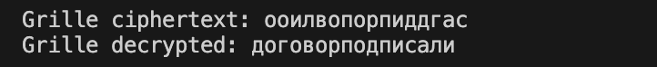

---
## Author
author:
  name: Мбах Наусси Джордан Вилфри
  degrees: BSc
  email: 1032265887@rudn.ru
  affiliation:
    - name: Российский университет дружбы народов им. П. Лумумбы
      country: Российская Федерация
      postal-code: 117198
      city: Москва
      address: ул. Миклухо-Маклая, д. 6
## Title
title: "Лабораторная работа 2"
subtitle: "Шифры перестановки"
license: CC BY
date: today
date-format: "YYYY-MM-DD"
---

# Информация

## Докладчик

:::::::::::::: {.columns align=center}
::: {.column width="70%"}

  * Мбах Наусси Джордан Вилфри
  * Студент 1 курса магистратуры
  * Группа НФИмд-01-26
  * Фундаментальная информатика и информационные технологии
  * Российский университет дружбы народов им. П. Лумумбы
  * [1032265887@rudn.ru](mailto:1032265887@rudn.ru)
  * <https://www.devjordan.com>

:::
::: {.column width="30%"}


:::
::::::::::::::

::: notes
- Поприветствовать аудиторию.
- Представиться кратко, даже если вас объявили.
:::

# Введение

## Цель работы

- Изучить и реализовать шифры перестановки на языке Python:
    - маршрутное шифрование (столбцовая перестановка)
    - шифрование с помощью решёток (решётка Флейснера)
    - шифр Виженера (таблица Виженера)
- Проверить корректность шифрования и расшифрования на контрольных примерах

::: notes
- Сформулировать цель одним предложением.
- Все три шифра рассматриваются на русском алфавите из 33 букв (с «ё»).
:::

## Теоретическая справка

- Шифр перестановки -- текст остаётся тем же набором букв, меняется только их порядок по ключу
- Маршрутное шифрование (Ф. Виет): текст вписывается в таблицу $m \times n$, криптограмма выписывается по столбцам в порядке пароля
- Решётка Флейснера (1881): квадрат $2k \times 2k$ заполняется за четыре поворота решётки, буквы выписываются по столбцам с паролем
- Таблица Виженера (1585): полиалфавитная замена -- каждая буква циклически сдвигается на позицию буквы пароля

::: notes
- Виженер исторически считался нераскрываемым до взлома Казиски в 1863 году.
- Пароль -- слово из неповторяющихся букв; порядок столбцов -- алфавитный порядок букв пароля.
:::

# Реализация

## Подготовка: алфавит и вспомогательные функции

```{.python code-line-numbers="1-4|6-13"}
RU_ALPHABET = "абвгдеёжзийклмнопрстуфхцчшщъыьэюя"
CHAR_INDEX = {char: index for index, char in enumerate(RU_ALPHABET)}
INDEX_CHAR = {index: char for index, char in enumerate(RU_ALPHABET)}
CHAR_COUNT = len(RU_ALPHABET)

def pad_plaintext(plaintext, total_length, fill_char="х"):
    text = plaintext.lower().replace(" ", "")
    if len(text) < total_length:
        text += fill_char * (total_length - len(text))
    return text

def column_order(password):
    return sorted(range(len(password)), key=lambda i: password[i].lower())
```

- Алфавит из 33 букв с «ё»; позиции нумеруются с нуля, обратные словари `CHAR_INDEX` и `INDEX_CHAR`
- `pad_plaintext` -- нижний регистр, удаление пробелов, дополнение символом `х` до нужной длины
- `column_order` -- номера столбцов в порядке алфавитного следования букв пароля

::: notes
- `CHAR_INDEX` -- буква → номер; `INDEX_CHAR` -- номер → буква.
- Обе подготовительные функции переиспользуются всеми тремя шифрами.
:::

## Маршрутное шифрование: шифрование

```{.python code-line-numbers="4-5|6-9|10|11-14"}
def route_encrypt(plaintext, n, m, password):
    assert len(password) == n, "Password length must be equal to n"
    padded = pad_plaintext(plaintext, n * m)

    grid = [[None] * n for _ in range(m)]
    idx = 0
    for i in range(m):
        for j in range(n):
            grid[i][j] = padded[idx]
            idx += 1
    order = column_order(password)
    result = []
    for col in order:
        for row in range(m):
            result.append(grid[row][col])
    return "".join(result)
```

- Текст дополняется до $m \cdot n$ и вписывается в таблицу $m \times n$ построчно
- Столбцы просматриваются в порядке пароля `column_order`, их содержимое выписывается в криптограмму

::: notes
- Пароль задаёт маршрут чтения: например, для пароля длиной $n$ столбцы нумеруются по алфавиту букв пароля.
- Расшифрование -- обратные действия: символы расставляются по столбцам, таблица считывается построчно.
:::

## Маршрутное шифрование: расшифрование

```{.python}
def route_decrypt(ciphertext, n, m, password):
    assert len(password) == n, "Password length must be equal to n"
    order = column_order(password)
    grid = [[None] * n for _ in range(m)]
    idx = 0
    for col in order:
        for row in range(m):
            grid[row][col] = ciphertext[idx]
            idx += 1
    result = []
    for i in range(m):
        for j in range(n):
            result.append(grid[i][j])
    return "".join(result)
```

- Криптограмма расставляется по столбцам в порядке пароля
- Считывание таблицы построчно восстанавливает открытый текст

::: notes
- Симметрия: шифрование читает столбцы по порядку пароля, расшифрование пишет в столбцы по тому же порядку.
:::

## Решётка Флейснера: построение маршрута (1/2)

```{.python code-line-numbers="1-2|4-8|9-16"}
def rotate_position(i, j, n):
    return (j, n - 1 - i)

def grille_fill_order(k):
    n = 2*k
    holes = [(i, j) for i in range(k) for j in range(k)]
    order = []
    for _ in range (n):
        order.extend(holes)
        holes = [rotate_position(i, j, n) for (i, j) in holes]
    return order
```

## Решётка Флейснера: построение маршрута (2/2)

```{.python code-line-numbers="1-2|4-8|9-16"}
def grille_encrypt(plaintext, k, password):
    n = 2*k
    assert len(password) == n, "Password length must be equal to 2k"
    padded = pad_plaintext(plaintext, n*n)
    order = grille_fill_order(k)
    grid = [[None] * n for _ in range(n)]
    for idx, (i, j) in enumerate(order):
        grid[i][j] = padded[idx]
    col_order = column_order(password)
    result = []
    for col in col_order:
        for row in range(n):
            result.append(grid[row][col])
    return "".join(result)
```

- Рабочий квадрат имеет размер $2k \times 2k$
- `rotate_position` поворачивает клетку на $90^\circ$; `grille_fill_order` строит последовательность из $4k^2$ позиций за $2k$ поворотов решётки
- Буквы вписываются в клетки в этом порядке, затем выписываются по столбцам с паролем

::: notes
- За четыре поворота квадрата $k \times k$ покрываются все клетки квадрата $2k \times 2k$ ровно по одному разу -- поэтому текст длины $n^2$ заполняет таблицу без остатка.
:::

## Решётка Флейснера: расшифрование

```{.python}
def grille_decrypt(ciphertext, k, password):
    n = k*2
    assert len(password) == n, "Password length must be equal to 2k"
    col_order = column_order(password)
    grid = [[None] * n for _ in range(n)]
    idx = 0
    for col in col_order:
        for row in range(n):
            grid[row][col] = ciphertext[idx]
            idx += 1
    order = grille_fill_order(k)
    result = []
    for (i, j) in order:
        result.append(grid[i][j])
    return "".join(result)
```

- Криптограмма расставляется по столбцам в порядке пароля
- Считывание клеток в обратном порядке (порядок решётки) восстанавливает текст

::: notes
- Порядок обхода решётки используется одинаково при шифровании и расшифровании.
:::

## Шифр Виженера: шифрование

```{.python code-line-numbers="6-9|10|11"}
def vigenere_encrypt(plaintext, password):
    plaintext = plaintext.lower().replace(" ", "")
    password = password.lower()
    result = []
    point_idx = 0
    for ch in plaintext:
        if ch in CHAR_INDEX:
            shift = CHAR_INDEX[password[point_idx]]
            new_idx = (CHAR_INDEX[ch] + shift) % CHAR_COUNT
            result.append(INDEX_CHAR[new_idx])
            point_idx = (point_idx + 1) % len(password)
    return "".join(result)
```

- Пароль записывается с повторениями над буквами сообщения
- Сдвиг буквы равен позиции соответствующей буквы пароля в алфавите: $T(a) = (a + a_i) \bmod m$
- Указатель `point_idx` циклически проходит по буквам пароля

::: notes
- Это полиалфавитный шифр: одна и та же буква текста шифруется по-разному в разных позициях.
:::

## Шифр Виженера: расшифрование

```{.python}
def vigenere_decrypt(ciphertext, password):
    password = password.lower()
    result = []
    point_idx = 0
    for ch in ciphertext:
        if ch in CHAR_INDEX:
            shift = CHAR_INDEX[password[point_idx]]
            new_idx = (CHAR_INDEX[ch] - shift) % CHAR_COUNT
            result.append(INDEX_CHAR[new_idx])
            point_idx = (point_idx + 1) % len(password)
    return "".join(result)
```

- Расшифрование -- вычитание того же сдвига: $T^{-1}(a) = (a - a_i) \bmod m$

::: notes
- В отличие от шифров перестановки, здесь ключ входит арифметически, поэтому нужна отдельная функция расшифрования.
:::

# Демонстрация

## Маршрутное шифрование

{width=75%}

- Текст: `нельзя недооценивать противника`, $n = 6$, $m = 5$, пароль `пароль`
- Криптограмма: `еенпнзоатаьовокннеьвлдирияцтих`
- Расшифровка: `нельзянедооцениватьпротивниках`

::: notes
- Пробелы удалены заранее, до длины $m \cdot n = 30$ текст дополнен символом `х`.
:::

## Решётка Флейснера

{width=75%}

- Текст: `договор подписали`, $k = 2$, пароль `шифр`
- Криптограмма: `ооилвопорпиддгас`
- Расшифровка: `договорподписали`

::: notes
- 16 букв текста ровно заполняют квадрат $4 \times 4$.
:::

## Шифр Виженера

{width=75%}

- Текст: `криптография серьезная наука`, пароль `математика`
- Криптограмма: `чрыфяохщкфхядйэьчршалнтшча`
- Расшифровка: `криптографиясерьезнаянаука`

::: notes
- Та же буква «р» в тексте шифруется по-разному -- видна полиалфавитность.
:::

# Заключение

## Выводы

- Шифры перестановки и видоизменённая таблица Виженера реализованы на Python и корректно работают на контрольных примерах
- Для столбцовых схем порядок чтения/записи столбца задаётся паролем, поэтому расшифрование симметрично шифрованию
- Решётка Флейснера покрывает квадрат $2k \times 2k$ за $2k$ поворотов, что определяет длину текста $4k^2$
- Шифр Виженера использует тот же алфавит и пароль как последовательность сдвигов -- полиалфавитная замена

::: notes
- Повторить главный вывод одним предложением.
- Готов ответить на вопросы.
:::